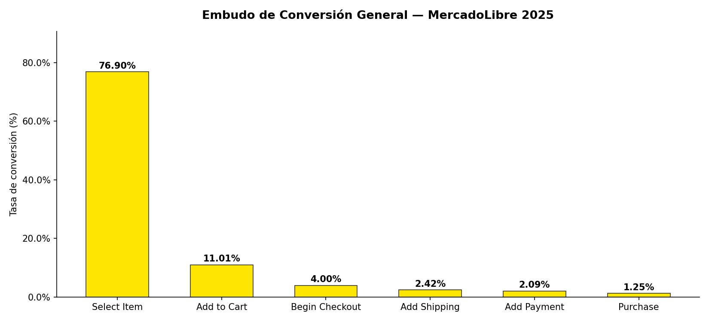
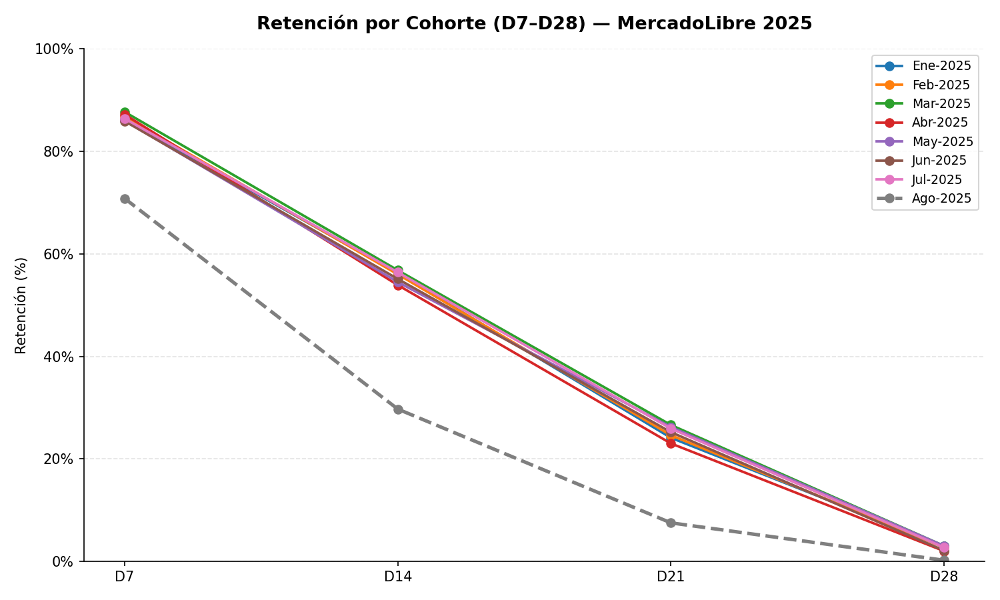
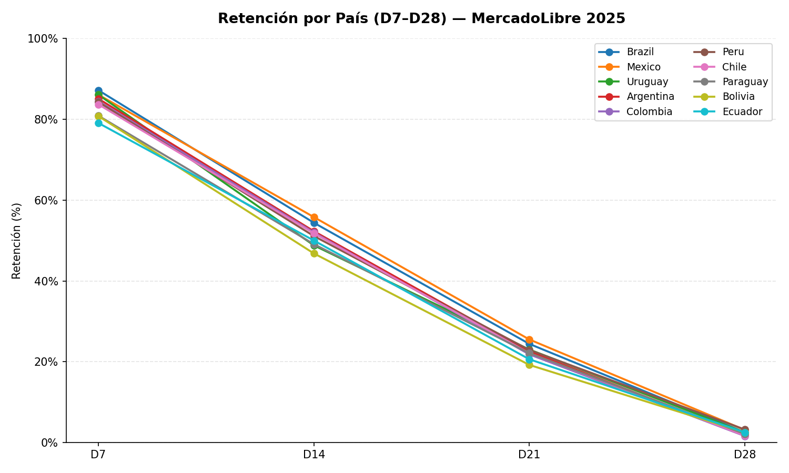

# 📊 MercadoLibre — Funnel & Retention Analysis

Análisis de embudo de conversión y retención de usuarios para MercadoLibre,
periodo **enero – agosto 2025**, segmentado por país y cohorte mensual.

---

## 🔍 Preguntas respondidas

| # | Pregunta |
|---|----------|
| 1 | ¿Cuál es la tasa de conversión entre cada etapa clave del embudo? |
| 2 | ¿En qué paso se observa la mayor caída porcentual de usuarios? |
| 3 | ¿Cómo varía esta pérdida por país? |
| 4 | ¿Qué tan bien retenemos a los usuarios a lo largo del tiempo (D7, D14, D21, D28)? |
| 5 | ¿Cómo se comporta la retención agrupada por país? |

---

## 📁 Estructura del repositorio

```
mercadolibre-funnel-retention-analysis/
├── data/
│   └── processed/
│       ├── embudo_general.csv
│       ├── embudo_por_pais.csv
│       ├── retencion_por_pais.csv
│       └── retencion_por_cohort.csv
├── scripts/
│   └── mercadolibre_resumen.py   ← script principal
├── screenshots/
│   ├── embudo_general.png
│   ├── retencion_cohortes.png
│   └── retencion_pais.png
├── README.md
└── requirements.txt
```

---

## 🚀 Cómo ejecutar

```bash
# 1. Clonar el repositorio
git clone https://github.com/tu-usuario/mercadolibre-funnel-retention-analysis.git
cd mercadolibre-funnel-retention-analysis

# 2. Instalar dependencias
pip install -r requirements.txt

# 3. Ejecutar el análisis
python scripts/mercadolibre_resumen.py
```

Los gráficos se guardan automáticamente en `screenshots/`.

---

## 📈 Hallazgos principales

### Embudo de Conversión General



| Etapa | Tasa (%) | Caída vs etapa anterior |
|---|---|---|
| Select Item | 76.90% | — |
| **Add to Cart** | **11.01%** | **▼ 65.89 pp ← mayor caída** |
| Begin Checkout | 4.00% | ▼ 7.01 pp |
| Add Shipping Info | 2.42% | ▼ 1.58 pp |
| Add Payment Info | 2.09% | ▼ 0.33 pp |
| Purchase | 1.25% | ▼ 0.84 pp |

> **Insight:** La transición *Select Item → Add to Cart* concentra la pérdida más grande del embudo (~66 pp).
> Mejorar esta etapa tiene el mayor potencial de impacto en la conversión final.

---

### Retención por Cohorte (D7 – D28)



- La retención a **D7 se mantiene estable entre 86–88%** en 7 de las 8 cohortes.
- A partir de **D14 cae ~30 pp** y en **D28 colapsa al 2–3%**.
- La cohorte de **agosto 2025 es una anomalía crítica**: D7 = 70.8%, D28 = 0.2%.
  Requiere investigación puntual (cambio de producto, problema técnico o estacional).

---

### Retención por País (D7 – D28)



| Mercado | D7 | D14 | D21 | D28 |
|---|---|---|---|---|
| 🇧🇷 Brazil | 87.2% | 54.4% | 24.4% | 2.5% |
| 🇲🇽 Mexico | 86.1% | 55.8% | 25.5% | **3.1%** |
| 🇵🇪 Peru | 84.3% | 51.1% | 22.9% | **3.2%** |
| 🇧🇴 Bolivia | 80.8% | 46.8% | 19.2% | 2.5% |
| 🇪🇨 Ecuador | 79.1% | 50.0% | 20.6% | 2.5% |

> **Insight:** México y Brasil lideran en retención. Bolivia y Ecuador presentan
> las métricas más bajas en todos los horizontes; se recomienda revisar la
> propuesta de valor y experiencia de usuario en esos mercados.

---

## 💡 Reflexión personal

**Etapa que mejoraría primero:**
La transición *Selección de ítem → Añadir al carrito*, por ser donde se pierde
la mayor cantidad de usuarios y donde una mejora marginal genera el mayor impacto
en la conversión final.

**Aprendizaje clave:**
Los usuarios muestran alto interés inicial (D7 ~87%) pero la gran mayoría no
regresa después de la primera semana. El reto está en construir hábito y valor
percibido en las primeras 14 días post-registro.

---

## 🛠 Stack técnico

| Herramienta | Uso |
|---|---|
| Python 3.x | Lenguaje principal |
| pandas | Estructuración y análisis de datos |
| matplotlib | Visualizaciones |
| openpyxl | Lectura del archivo fuente `.xlsx` |

---

## 👤 Autor

**Jesus** · Análisis de datos · 2025
